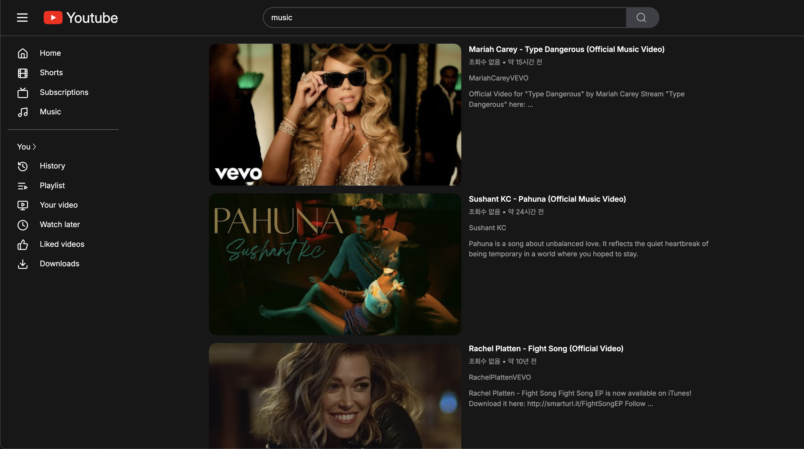
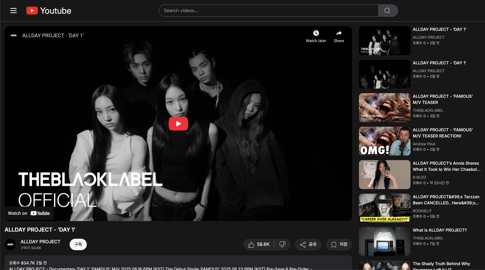

# 🎬 React YouTube Clone

React 학습을 위해 개발한 YouTube 클론 애플리케이션입니다. YouTube Data API를 활용하여 실제 YouTube와 유사한 사용자 경험을 제공합니다.

**🔗 배포 링크: [YouTube Clone 보러가기](https://kwonben-youtube-react.netlify.app)**

<div style="display: flex; gap: 10px; flex-wrap: wrap;">
  
  
  
</div>

## 📋 프로젝트 개요

이 프로젝트는 React와 관련 기술을 학습하기 위한 목적으로 제작되었습니다. YouTube API를 사용하여 주요 기능들을 구현하며 리액트 생태계의 라이브러리와 기술을 적용해보았습니다.

### 주요 기능

- 인기 동영상 조회 (홈 화면)
- 동영상 검색 기능
- 동영상 상세 페이지 (제목, 설명, 조회수, 좋아요 수 등)
- 채널 정보 조회
- 반응형 디자인 (모바일, 태블릿, 데스크탑 지원)
- 사이드바 토글 기능

## 🛠 기술 스택

### 프론트엔드

- **React 19**: 최신 버전의 React를 사용하여 UI 구현
- **TypeScript**: 타입 안정성 확보 및 개발 효율성 향상
- **React Router 7**: 클라이언트 사이드 라우팅 및 네비게이션 관리
- **TanStack React Query**: 서버 상태 관리 및 데이터 페칭
- **Tailwind CSS 4**: 유틸리티 기반 CSS 프레임워크로 UI 스타일링
- **Lucide React**: 아이콘 라이브러리
- **Axios**: HTTP 요청 처리
- **date-fns**: 날짜 포맷팅 유틸리티

### 개발 도구

- **Vite**: 빠른 개발 환경 및 번들링
- **ESLint & Prettier**: 코드 품질 및 스타일 일관성 유지

## 🏗 프로젝트 구조

```
app/
├── api/                 # API 통신 관련 로직
├── components/          # 재사용 가능한 UI 컴포넌트
├── context/             # React Context API를 활용한 상태 관리
├── routes/              # 페이지 컴포넌트 및 라우팅 구조
└── utils/               # 유틸리티 함수 (날짜/숫자 포맷팅 등)
```

## 🧩 주요 컴포넌트 및 로직

### API 통합

- YouTube Data API v3를 활용하여 실제 데이터 통합
- 인터페이스 기반 설계로 테스트 용이성 및 유지보수성 확보
- Axios 인스턴스를 활용한 API 요청 구성

### 상태 관리

- React Context API를 활용한 전역 상태 관리
- TanStack Query를 활용한 서버 상태 캐싱 및 관리
- 사이드바 상태 등 UI 상태 관리

### 반응형 UI

- Tailwind CSS의 반응형 유틸리티를 활용한 다양한 화면 크기 지원
- 그리드 시스템을 활용한 동영상 카드 레이아웃

## 🚀 설치 및 실행 방법

### 요구사항

- Node.js 18.0.0 이상
- npm 또는 yarn

### 설치

```bash
# 저장소 클론
git clone https://github.com/suneogkwon/react-youtube-clone.git

# 의존성 설치
cd react-youtube-clone
npm install
```

### 환경 변수 설정

`.env` 파일을 프로젝트 루트에 생성하고 YouTube API 키를 설정합니다:

```
VITE_YOUTUBE_API_KEY=your_youtube_api_key
```

### 개발 모드 실행

```bash
npm run dev
```

### 빌드 및 배포

```bash
npm run build
npm run start
```

## 📚 학습 포인트

이 프로젝트를 통해 다음과 같은 기술적 역량을 향상시켰습니다:

1. **최신 React 패턴**: 함수형 컴포넌트, 훅(Hooks) 기반 개발
2. **TypeScript**: 타입 안전성과 코드 품질 향상
3. **상태 관리**: React Query를 활용한 서버 상태 관리 패턴
4. **컴포넌트 설계**: 재사용 가능한 컴포넌트 설계 및 구현
5. **반응형 웹 디자인**: 다양한 디바이스에 대응하는 UI 구현
6. **API 통합**: 외부 API 연동 및 데이터 가공

## 🔍 향후 개선 사항

- 라이트 모드 지원
- 사용자 인증 및 개인화 기능
- 코멘트 섹션 구현
- 재생 목록 기능
- 성능 최적화 (Code Splitting, Lazy Loading)

## 📝 라이센스

이 프로젝트는 MIT 라이센스 하에 배포됩니다.
